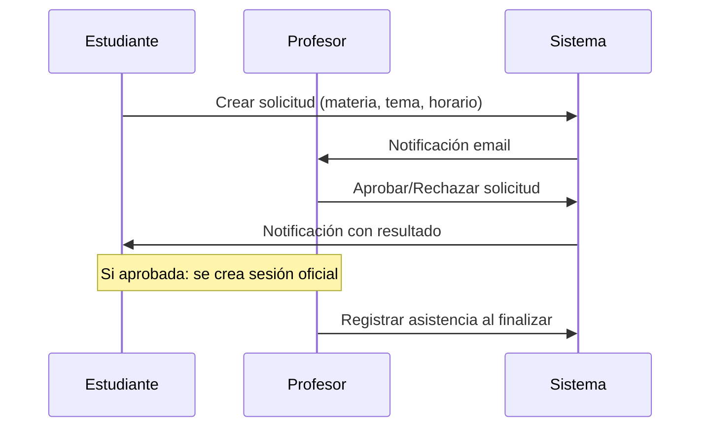
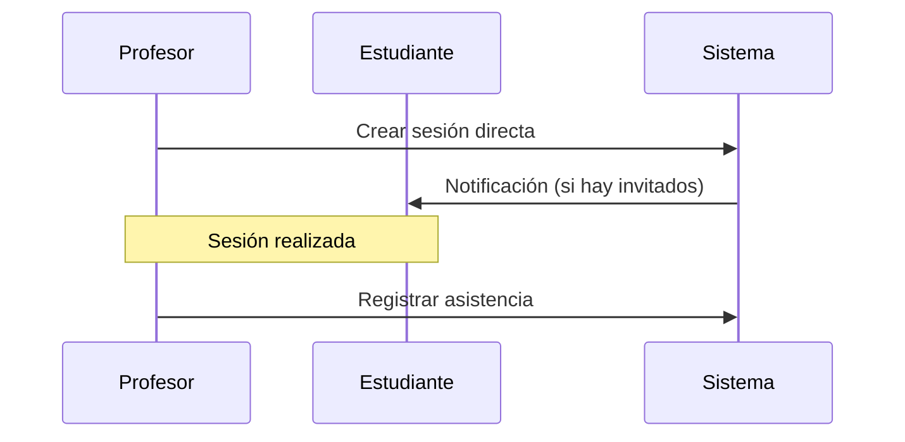

# 📋 User Stories - Sistema de Asesorías Universitarias

## 🎯 **Visión General**

Este documento contiene las historias de usuario para el sistema de asesorías universitarias, organizadas por épicas y priorizadas según el flujo de negocio identificado.

---

## 📊 **Épicas y Priorización**

### **🏆 Prioridad Alta (MVP)**
1. **[Epic 1: Gestión de Solicitudes de Asesoría](./epic-1-advisory-requests.md)**
   - Flujo completo: solicitud → aprobación/rechazo → notificaciones
   - **5 User Stories** | **Complejidad: Alta**

2. **[Epic 2: Creación Directa y Registro de Asistencia](./epic-2-direct-sessions.md)**
   - Creación ad-hoc de sesiones y registro de asistencia
   - **4 User Stories** | **Complejidad: Media**

### **🔧 Prioridad Media**
3. **[Epic 3: Disponibilidad y Horarios](./epic-3-availability.md)**
   - Gestión de horarios recurrentes de profesores
   - **3 User Stories** | **Complejidad: Media**

4. **[Epic 4: Gestión de Materias y Asignaciones](./epic-4-subjects-management.md)**
   - Administración de catálogo y asignaciones profesor-materia
   - **4 User Stories** | **Complejidad: Baja**

### **📈 Prioridad Baja (Futuras versiones)**
5. **[Epic 5: Reportes y Estadísticas](./epic-5-reports.md)**
   - Análisis de datos y métricas de uso
   - **3 User Stories** | **Complejidad: Media**

6. **[Epic 6: Notificaciones y Comunicación](./epic-6-notifications.md)**
   - Sistema de notificaciones por email y recordatorios
   - **3 User Stories** | **Complejidad: Baja**

---

## 🎭 **Roles del Sistema**

| Rol | Descripción | Responsabilidades Principales |
|-----|-------------|-------------------------------|
| **STUDENT** | Estudiante universitario | Solicitar asesorías, asistir a sesiones |
| **PROFESSOR** | Profesor universitario | Aprobar solicitudes, crear sesiones, registrar asistencia |
| **ADMIN** | Administrador del sistema | Gestionar materias, generar reportes, auditoría completa |

---

## 🔄 **Flujos Principales**

### **Flujo 1: Solicitud de Asesoría (Recomendado)**

### **Flujo 2: Creación Directa (Alternativo)**

---

## 📈 **Métricas de Éxito**

### **Métricas de Adopción**
- % de profesores que usan el sistema vs. Excel/papel
- Número de solicitudes procesadas por mes
- Tiempo promedio de respuesta de profesores

### **Métricas de Eficiencia**
- Tiempo de creación de una sesión (objetivo: <2 minutos)
- % de sesiones con asistencia registrada
- Accuracy de reportes vs. registros manuales

### **Métricas de Satisfacción**
- NPS de estudiantes y profesores
- % de solicitudes aprobadas
- Tiempo promedio entre solicitud y sesión

---

## 🛠️ **Cambios Técnicos Requeridos**

> **⚠️ Importante**: Para implementar estas historias se requieren cambios en el modelo de datos actual.

### **Nuevas Entidades**
- `AdvisoryRequest` - Solicitudes de asesoría
- `NotificationLog` - Registro de notificaciones enviadas

### **Campos Adicionales**
- Estados en sesiones (SCHEDULED, COMPLETED, CANCELLED)
- Auditoría (created_by, updated_by, timestamps)
- Capacidad máxima por sesión/disponibilidad

📄 **Ver detalles completos en**: [database-changes-required.md](./database-changes-required.md)

---

## 📅 **Roadmap Sugerido**

### **Sprint 1 (2-3 semanas)**
- Epic 1: Solicitudes de asesoría (US-001 a US-003)
- Ajustes de base de datos requeridos

### **Sprint 2 (2 semanas)**  
- Epic 2: Creación directa y asistencia (US-004 a US-007)
- Epic 4: Gestión básica de materias (US-013 a US-015)

### **Sprint 3 (2 semanas)**
- Epic 3: Disponibilidad (US-008 a US-010)
- Epic 6: Notificaciones básicas (US-019 a US-020)

### **Sprint 4 (1-2 semanas)**
- Epic 5: Reportes (US-016 a US-018)
- Refinamientos y optimizaciones

---

## 📚 **Archivos de Documentación**

- **[Epic 1: Gestión de Solicitudes](./epic-1-advisory-requests.md)** - Flujo principal del sistema
- **[Epic 2: Creación Directa](./epic-2-direct-sessions.md)** - Flujo alternativo y asistencia  
- **[Epic 3: Disponibilidad](./epic-3-availability.md)** - Horarios recurrentes
- **[Epic 4: Gestión de Materias](./epic-4-subjects-management.md)** - Administración
- **[Epic 5: Reportes](./epic-5-reports.md)** - Analytics y métricas
- **[Epic 6: Notificaciones](./epic-6-notifications.md)** - Comunicación
- **[Cambios en BD](./database-changes-required.md)** - Modificaciones requeridas
- **[API Endpoints](./api-endpoints-summary.md)** - Resumen de endpoints por épica

---

*Última actualización: 31 de octubre de 2025*